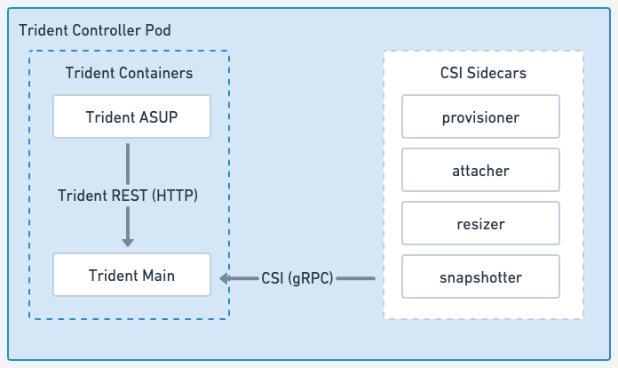

= Astra Trident 아키텍처
:hardbreaks:
:allow-uri-read: 
:icons: font
:imagesdir: ../media/

[role="lead"]
Astra Trident는 클러스터의 각 작업자 노드에서 단일 컨트롤러 Pod와 노드 Pod로 실행됩니다. Astra Trident 볼륨을 마운트하려는 호스트에서 노드 포드가 실행되고 있어야 합니다.

== 컨트롤러 Pod 및 노드 포드 이해

Astra Trident가 단일 플랫폼으로 구축됩니다 <<Trident 컨트롤러 Pod>> 및 하나 이상 <<Trident 노드 Pod>> Kubernetes 클러스터에서 표준 Kubernetes_CSI Sidecar Containers_를 사용하여 CSI 플러그인 배포를 간소화합니다. link:https://kubernetes-csi.github.io/docs/sidecar-containers.html["Kubernetes CSI Sidecar Containers의 약어입니다"^] Kubernetes 스토리지 커뮤니티에서 유지 관리합니다.

쿠버네티스 link:https://kubernetes.io/docs/concepts/scheduling-eviction/assign-pod-node/["노드 선택기"^] 및 link:https://kubernetes.io/docs/concepts/scheduling-eviction/taint-and-toleration/["관용과 오해"^] 포드를 특정 노드 또는 기본 노드에서 실행하도록 제한하는 데 사용됩니다. Astra Trident 설치 중에 컨트롤러 및 노드 포드의 노드 선택기 및 허용을 구성할 수 있습니다.

* 컨트롤러 플러그인은 스냅샷 및 크기 조정과 같은 볼륨 프로비저닝 및 관리를 처리합니다.
* 노드 플러그인은 스토리지에 노드를 연결하는 작업을 처리합니다.

.Kubernetes 클러스터에 배포된 Astra Trident

=== Trident 컨트롤러 Pod

Trident 컨트롤러 Pod는 CSI 컨트롤러 플러그인을 실행하는 단일 Pod입니다.

* NetApp 스토리지에서 볼륨을 프로비저닝하고 관리하는 업무를 담당합니다
* Kubernetes 배포에 의해 관리됩니다
* 설치 매개변수에 따라 컨트롤 플레인 또는 작업자 노드에서 실행할 수 있습니다.

.Trident 컨트롤러 Pod 다이어그램

=== Trident 노드 Pod

Trident 노드 Pod는 CSI 노드 플러그인을 실행하는 권한 있는 Pod입니다.

* 호스트에서 실행 중인 Pod에 대한 스토리지 마운트 및 마운트 해제를 담당합니다
* Kubernetes DemonSet에서 관리합니다
* NetApp 스토리지를 마운트할 모든 노드에서 실행해야 합니다

.Trident 노드 Pod 다이어그램

== 지원되는 Kubernetes 클러스터 아키텍처

Astra Trident는 다음 Kubernetes 아키텍처에서 지원됩니다.

[cols="3,1,2"]
|===
| Kubernetes 클러스터 아키텍처 | 지원 | 기본 설치 

| 단일 마스터, 컴퓨팅 | 예  a| 
예

| 다중 마스터, 컴퓨팅 | 예  a| 
예

| 마스터, "etcd", 컴퓨팅 | 예  a| 
예

| 마스터, 인프라, 컴퓨팅 | 예  a| 
예

|===