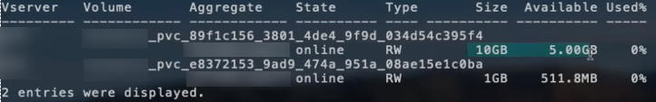

= 구성 옵션 및 예
:hardbreaks:
:allow-uri-read: 
:icons: font
:imagesdir: ../media/

Astra Trident 설치를 통해 ONTAP NAS 드라이버를 생성하고 사용하는 방법에 대해 알아보십시오. 이 섹션에서는 백엔드 구성 예제 및 백엔드를 StorageClasses에 매핑하는 방법에 대한 세부 정보를 제공합니다.

== 백엔드 구성 옵션

백엔드 구성 옵션은 다음 표를 참조하십시오.

[cols="3"]
|===
| 매개 변수 | 설명 | 기본값 

| '내전' |  | 항상 1 

| 'torageDriverName'입니다 | 스토리지 드라이버의 이름입니다 | "ONTAP-NAS", "ONTAP-NAS-이코노미", "ONTAP-NAS-Flexgroup", "ONTAP-SAN", "ONTAP-SAN-이코노미" 

| 백엔드이름 | 사용자 지정 이름 또는 스토리지 백엔드 | 드라이버 이름 + “_” + dataLIF 

| 마나멘타LIF | 클러스터 또는 SVM 관리 LIF의 IP 주소입니다 | “10.0.0.1”, “[2001:1234:ABCD::fee]” 

| 다타LIF | 프로토콜 LIF의 IP 주소입니다. IPv6의 경우 대괄호를 사용합니다. 설정한 후에는 업데이트할 수 없습니다 | 지정되지 않은 경우 SVM에서 파생됩니다 

| 자동 내보내기 정책 | 자동 엑스포트 정책 생성 및 업데이트 활성화 [부울] | 거짓 

| 자동 내보내기 | "autoExportPolicy"가 활성화된 경우 Kubernetes 노드 IP를 필터링하기 위한 CIDR 목록입니다 | ["0.0.0.0/0", "::/0"]" 

| '라벨' | 볼륨에 적용할 임의의 JSON 형식 레이블 세트입니다 | “” 

| '고객증명서' | Base64 - 클라이언트 인증서의 인코딩된 값입니다. 인증서 기반 인증에 사용됩니다 | “” 

| 'clientPrivateKey'입니다 | Base64 - 클라이언트 개인 키의 인코딩된 값입니다. 인증서 기반 인증에 사용됩니다 | “” 

| 신탁인증서다 | Base64 - 신뢰할 수 있는 CA 인증서의 인코딩된 값입니다. 선택 사항. 인증서 기반 인증에 사용됩니다 | “” 

| '사용자 이름' | 클러스터/SVM에 연결할 사용자 이름입니다. 자격 증명 기반 인증에 사용됩니다 |  

| "암호" | 클러스터/SVM에 연결하는 암호 자격 증명 기반 인증에 사용됩니다 |  

| 'VM'입니다 | 사용할 스토리지 가상 머신입니다 | SVM 'managementLIF'가 지정된 경우에 파생됩니다 

| “인명이름”입니다 | 사용할 SAN 볼륨에 대한 igroup의 이름입니다 | “삼중 - <backend-UUID>” 

| '토르agePrefix' | SVM에서 새 볼륨을 프로비저닝할 때 사용되는 접두사 설정한 후에는 업데이트할 수 없습니다 | "삼중류" 

| 제한선태사용법 | 사용량이 이 비율을 초과하면 프로비저닝이 실패합니다. ONTAP * 용 아마존 FSx에는 * 가 적용되지 않습니다 | “”(기본적으로 적용되지 않음) 

| LimitVolumeSize | 요청한 볼륨 크기가 이코노미 드라이버에 대한 이 값보다 큰 경우 용량 할당에 실패합니다. | “”(기본적으로 적용되지 않음) 

| '오만유연한' | FlexVol당 최대 LUN 수는 범위[50, 200]에 있어야 합니다. | “100” 

| debugTraceFlags를 선택합니다 | 문제 해결 시 사용할 디버그 플래그입니다. 예: {“api”:false, “method”:true} | null입니다 

| nfsMountOptions를 선택합니다 | 쉼표로 구분된 NFS 마운트 옵션 목록입니다 | “” 

| "케트리스퍼플랙스볼륨" | FlexVol당 최대 qtree, 범위 [50, 300]에 있어야 함 | “200” 

| 'useREST' | ONTAP REST API를 사용하는 부울 매개 변수입니다. * 기술 미리 보기 * | 거짓 
|===

NOTE: "useREST"는 프로덕션 워크로드가 아닌 테스트 환경에 권장되는** 기술 미리 보기로 제공됩니다. "true"로 설정하면 Astra Trident는 ONTAP REST API를 사용하여 백엔드와 통신합니다. 이 기능을 사용하려면 ONTAP 9.9 이상이 필요합니다. 또한 사용되는 ONTAP 로그인 역할은 ONTAP 애플리케이션에 대한 액세스 권한이 있어야 합니다. 이는 미리 정의된 vsadmin과 cluster-admin의 역할에서 충족됩니다.

ONTAP 클러스터와 통신하려면 인증 매개 변수를 제공해야 합니다. 보안 로그인 또는 설치된 인증서의 사용자 이름/암호일 수 있습니다.

WARNING: NetApp ONTAP 백엔드에 Amazon FSx를 사용하는 경우 'limitAggregateUsage' 매개 변수를 지정하지 마십시오. NetApp ONTAP용 Amazon FSx에서 제공하는 "fsxadmin" 및 "vsadmin" 역할에는 애그리게이트 사용을 검색하고 Astra Trident를 통해 제한하는 데 필요한 액세스 권한이 없습니다.

WARNING: 문제 해결 및 자세한 로그 덤프가 필요한 경우가 아니면 debugTraceFlags를 사용하지 마십시오.

NOTE: 백엔드를 생성할 때 생성 후에는 "다LIF"와 "toragePrefix"를 수정할 수 없습니다. 이러한 매개 변수를 업데이트하려면 새 백엔드를 생성해야 합니다.

'managementLIF' 옵션에 대해 FQDN(정규화된 도메인 이름)을 지정할 수 있습니다. 또한 dataLIF 옵션에 FQDN을 지정할 수 있으며, 이 경우 NFS 마운트 작업에 FQDN이 사용됩니다. 이렇게 하면 라운드 로빈 DNS를 생성하여 여러 데이터 LIF 간에 로드 밸런싱을 수행할 수 있습니다.

모든 ONTAP 드라이버에 대한 manementLIF도 IPv6 주소로 설정할 수 있습니다. '--use-ipv6' 플래그를 사용하여 Astra Trident를 설치하십시오. 대괄호 안에 있는 'managementLIF' IPv6 주소를 정의할 때는 주의해야 합니다.

WARNING: IPv6 주소를 사용할 때는 [28e8:d9fb:a825:b7bf:69a8:d02f:9e7b:3555]와 같은 대괄호 안에 'managementLIF' 및 'dataLIF'(백엔드 정의에 포함된 경우)가 정의되어 있는지 확인하십시오. 다타LIF가 제공되지 않으면 Astra Trident가 SVM에서 IPv6 데이터 LIF를 가져옵니다.

CSI Trident는 autoExportPolicy와 autoExportCIDR 옵션을 사용하여 내보내기 정책을 자동으로 관리할 수 있습니다. 이 기능은 모든 ONTAP-NAS- * 드라이버에 대해 지원됩니다.

ONTAP-NAS-이코노미 드라이버의 경우 LimitVolumeSize 옵션도 qtree 및 LUN에 대해 관리하는 볼륨의 최대 크기를 제한하고, qtreesPerFlexvol 옵션을 사용하면 FlexVol당 최대 qtree 수를 사용자 지정할 수 있습니다.

nfsMountOptions 매개 변수를 사용하여 마운트 옵션을 지정할 수 있습니다. Kubernetes 영구 볼륨의 마운트 옵션은 일반적으로 스토리지 클래스에서 지정되지만 스토리지 클래스에 마운트 옵션이 지정되지 않은 경우 Astra Trident는 스토리지 백엔드의 구성 파일에 지정된 마운트 옵션을 사용하여 로 돌아갑니다. 스토리지 클래스 또는 구성 파일에 마운트 옵션을 지정하지 않으면 Astra Trident가 연결된 영구 볼륨에 마운트 옵션을 설정하지 않습니다.

NOTE: Astra Trident는 ONTAP-NAS와 ONTAP-NAS-Flexgroup을 사용하여 생성된 모든 볼륨의 “Comments” 필드에 제공 레이블을 설정합니다. 사용된 드라이버에 따라 FlexVol('ONTAP-NAS') 또는 FlexGroup('ONTAP-NAS-Flexgroup')에 주석이 설정됩니다. Astra Trident는 스토리지 풀에 있는 모든 레이블을 프로비저닝할 때 스토리지 볼륨에 복사합니다. 스토리지 관리자는 스토리지 풀별로 레이블을 정의하고 스토리지 풀에서 생성된 모든 볼륨을 그룹화할 수 있습니다. 이를 통해 백엔드 구성에서 제공되는 사용자 지정 가능한 레이블 세트를 기반으로 볼륨을 쉽게 구별할 수 있습니다.

=== 볼륨 프로비저닝을 위한 백엔드 구성 옵션

구성의 특수 섹션에서 이러한 옵션을 사용하여 각 볼륨이 기본적으로 프로비저닝되는 방식을 제어할 수 있습니다. 예를 들어, 아래 구성 예제를 참조하십시오.

[cols="3"]
|===
| 매개 변수 | 설명 | 기본값 

| '팩시배부 | LUN에 대한 공간 할당 | "참" 

| '예비공간' | 공간 예약 모드, "없음"(씬) 또는 "볼륨"(일반) | "없음" 

| 냅샷정책 | 사용할 스냅샷 정책입니다 | "없음" 

| "qosPolicy" | 생성된 볼륨에 할당할 QoS 정책 그룹입니다. 스토리지 풀/백엔드에서 qosPolicy 또는 adapativeQosPolicy 중 하나를 선택합니다 | “” 

| 적응성 QosPolicy | 생성된 볼륨에 할당할 적응형 QoS 정책 그룹입니다. 스토리지 풀/백엔드에서 qosPolicy 또는 adapativeQosPolicy 중 하나를 선택합니다. ONTAP에서 지원되지 않음 - NAS - 이코노미 | “” 

| 안산예비역 | 스냅샷 "0"에 예약된 볼륨의 백분율 | "스냅샷 정책"이 "없음"이면 "없음" 

| 'plitOnClone'을 선택합니다 | 생성 시 상위 클론에서 클론을 분할합니다 | "거짓" 

| 암호화 | NetApp 볼륨 암호화를 활성화합니다 | "거짓" 

| '생태성 스타일'을 참조하십시오 | 새로운 볼륨에 대한 보안 스타일 | “UNIX” 

| '계층화 정책' | "없음"을 사용하는 계층화 정책 | ONTAP 9.5 이전 SVM-DR 구성의 경우 "스냅샷 전용 

| unixPermissions | 모드를 선택합니다 | “777” 

| 스냅샷 디렉토리 | '.snapshot' 디렉토리의 가시성을 제어합니다 | "거짓" 

| 내보내기 정책 | 사용할 엑스포트 정책 | “기본값” 

| 보안 스타일 | 새로운 볼륨에 대한 보안 스타일 | “UNIX” 
|===

NOTE: Astra Trident와 함께 QoS 정책 그룹을 사용하려면 ONTAP 9.8 이상이 필요합니다. 비공유 QoS 정책 그룹을 사용하고 정책 그룹이 각 구성요소별로 적용되었는지 확인하는 것이 좋습니다. 공유 QoS 정책 그룹은 모든 워크로드의 총 처리량에 대해 상한을 적용합니다.

다음은 기본값이 정의된 예입니다.

[listing]
----
{
  "version": 1,
  "storageDriverName": "ontap-nas",
  "backendName": "customBackendName",
  "managementLIF": "10.0.0.1",
  "dataLIF": "10.0.0.2",
  "labels": {"k8scluster": "dev1", "backend": "dev1-nasbackend"},
  "svm": "trident_svm",
  "username": "cluster-admin",
  "password": "password",
  "limitAggregateUsage": "80%",
  "limitVolumeSize": "50Gi",
  "nfsMountOptions": "nfsvers=4",
  "debugTraceFlags": {"api":false, "method":true},
  "defaults": {
    "spaceReserve": "volume",
    "qosPolicy": "premium",
    "exportPolicy": "myk8scluster",
    "snapshotPolicy": "default",
    "snapshotReserve": "10"
  }
}
----
ONTAP-NAS와 ONTAP-NAS-Flexgroups의 경우, Astra Trident는 이제 새로운 계산을 통해 스냅샷 예비 공간 비율 및 PVC로 FlexVol의 크기를 올바르게 조정했습니다. 사용자가 PVC를 요청하면 Astra Trident는 새 계산을 사용하여 더 많은 공간을 가진 원본 FlexVol를 생성합니다. 이 계산을 통해 사용자는 PVC에서 요청한 쓰기 가능 공간을 확보할 수 있으며 요청된 공간보다 적은 공간을 확보할 수 있습니다. v21.07 이전에는 사용자가 스냅샷 보존 공간을 50%로 하여 PVC(예: 5GiB)를 요청할 때 쓰기 가능한 공간은 2.5GiB에 불과합니다. 이는 사용자가 요청한 전체 볼륨과 스냅샷 보존 비율이 다르기 때문입니다. Trident 21.07을 사용하면 쓰기 가능한 공간이 요청되고 Astra Trident는 '스냅샷 보존' 번호를 전체 볼륨의 백분율로 정의합니다. 이는 ONTAP-NAS-이코노미(ONTAP-NAS-이코노미)에는 적용되지 않습니다. 이 작동 방식을 보려면 다음 예를 참조하십시오.

계산은 다음과 같습니다.

[listing]
----
Total volume size = (PVC requested size) / (1 - (snapshotReserve percentage) / 100)
----
snapshotReserve = 50%, PVC request = 5GiB의 경우, 총 볼륨 크기는 2/.5 = 10GiB이고 사용 가능한 크기는 5GiB입니다. 이는 사용자가 PVC 요청에서 요청한 것입니다. 'volume show' 명령은 다음 예와 유사한 결과를 표시합니다.

이전 설치에서 기존 백엔드는 Astra Trident를 업그레이드할 때 위에서 설명한 대로 볼륨을 프로비저닝합니다. 업그레이드하기 전에 생성한 볼륨의 경우 변경 사항을 관찰하기 위해 볼륨의 크기를 조정해야 합니다. 예를 들어, '스냅샷 보존 = 50'의 2GiB PVC는 쓰기 가능한 공간 1GiB를 제공하는 볼륨을 낳았습니다. 예를 들어, 볼륨을 3GiB로 조정하면 애플리케이션에 6GiB 볼륨의 쓰기 가능 공간이 3GiB로 표시됩니다.

== 최소 구성의 예

다음 예에서는 대부분의 매개 변수를 기본값으로 두는 기본 구성을 보여 줍니다. 이는 백엔드를 정의하는 가장 쉬운 방법입니다.

NOTE: Trident가 있는 NetApp ONTAP에서 Amazon FSx를 사용하는 경우 IP 주소 대신 LIF에 대한 DNS 이름을 지정하는 것이 좋습니다.

=== ONTAP - 인증서 기반 인증을 갖춘 NAS 드라이버

이는 최소 백엔드 구성의 예입니다. clientCertificate, clientPrivateKey, trustedCACertificate(신뢰할 수 있는 CA를 사용하는 경우 선택 사항)가 backend.json에 채워지고 클라이언트 인증서, 개인 키, 트러스트된 CA 인증서의 base64로 인코딩된 값을 각각 가져갑니다.

[listing]
----
{
  "version": 1,
  "backendName": "DefaultNASBackend",
  "storageDriverName": "ontap-nas",
  "managementLIF": "10.0.0.1",
  "dataLIF": "10.0.0.15",
  "svm": "nfs_svm",
  "clientCertificate": "ZXR0ZXJwYXB...ICMgJ3BhcGVyc2",
  "clientPrivateKey": "vciwKIyAgZG...0cnksIGRlc2NyaX",
  "trustedCACertificate": "zcyBbaG...b3Igb3duIGNsYXNz",
  "storagePrefix": "myPrefix_"
}
----

=== 자동 엑스포트 정책이 포함된 ONTAP-NAS 드라이버

이 예에서는 Astra Trident가 동적 엑스포트 정책을 사용하여 엑스포트 정책을 자동으로 생성하고 관리하도록 지시하는 방법을 보여 줍니다. 이는 ONTAP-NAS-이코노미 및 ONTAP-NAS-Flexgroup 드라이버에도 동일하게 적용됩니다.

[listing]
----
{
    "version": 1,
    "storageDriverName": "ontap-nas",
    "managementLIF": "10.0.0.1",
    "dataLIF": "10.0.0.2",
    "svm": "svm_nfs",
    "labels": {"k8scluster": "test-cluster-east-1a", "backend": "test1-nasbackend"},
    "autoExportPolicy": true,
    "autoExportCIDRs": ["10.0.0.0/24"],
    "username": "admin",
    "password": "secret",
    "nfsMountOptions": "nfsvers=4",
}
----

=== ONTAP-NAS-flexgroup 드라이버

[listing]
----
{
    "version": 1,
    "storageDriverName": "ontap-nas-flexgroup",
    "managementLIF": "10.0.0.1",
    "dataLIF": "10.0.0.2",
    "labels": {"k8scluster": "test-cluster-east-1b", "backend": "test1-ontap-cluster"},
    "svm": "svm_nfs",
    "username": "vsadmin",
    "password": "secret",
}
----

=== ONTAP - IPv6를 사용하는 NAS 드라이버

[listing]
----
{
 "version": 1,
 "storageDriverName": "ontap-nas",
 "backendName": "nas_ipv6_backend",
 "managementLIF": "[5c5d:5edf:8f:7657:bef8:109b:1b41:d491]",
 "labels": {"k8scluster": "test-cluster-east-1a", "backend": "test1-ontap-ipv6"},
 "svm": "nas_ipv6_svm",
 "username": "vsadmin",
 "password": "netapp123"
}
----

=== ONTAP - NAS - 경제적인 드라이버

[listing]
----
{
    "version": 1,
    "storageDriverName": "ontap-nas-economy",
    "managementLIF": "10.0.0.1",
    "dataLIF": "10.0.0.2",
    "svm": "svm_nfs",
    "username": "vsadmin",
    "password": "secret"
}
----

== 가상 스토리지 풀의 백엔드 예

아래 표시된 백엔드 정의 샘플 파일에서 'paceReserve'는 none, 'pacteAllocation'은 false, 암호화 같은 모든 스토리지 풀에 대해 특정 기본값이 설정됩니다. 가상 스토리지 풀은 스토리지 섹션에 정의됩니다.

이 예에서는 일부 스토리지 풀이 자체 'spaceReserve', 'spaceAllocation' 및 'encryption' 값을 설정하고 일부 풀은 위에 설정된 기본값을 덮어씁니다.

=== ONTAP - NAS 드라이버

[listing]
----
{
    {
    "version": 1,
    "storageDriverName": "ontap-nas",
    "managementLIF": "10.0.0.1",
    "dataLIF": "10.0.0.2",
    "svm": "svm_nfs",
    "username": "admin",
    "password": "secret",
    "nfsMountOptions": "nfsvers=4",

    "defaults": {
          "spaceReserve": "none",
          "encryption": "false",
          "qosPolicy": "standard"
    },
    "labels":{"store":"nas_store", "k8scluster": "prod-cluster-1"},
    "region": "us_east_1",
    "storage": [
        {
            "labels":{"app":"msoffice", "cost":"100"},
            "zone":"us_east_1a",
            "defaults": {
                "spaceReserve": "volume",
                "encryption": "true",
                "unixPermissions": "0755",
                "adaptiveQosPolicy": "adaptive-premium"
            }
        },
        {
            "labels":{"app":"slack", "cost":"75"},
            "zone":"us_east_1b",
            "defaults": {
                "spaceReserve": "none",
                "encryption": "true",
                "unixPermissions": "0755"
            }
        },
        {
            "labels":{"app":"wordpress", "cost":"50"},
            "zone":"us_east_1c",
            "defaults": {
                "spaceReserve": "none",
                "encryption": "true",
                "unixPermissions": "0775"
            }
        },
        {
            "labels":{"app":"mysqldb", "cost":"25"},
            "zone":"us_east_1d",
            "defaults": {
                "spaceReserve": "volume",
                "encryption": "false",
                "unixPermissions": "0775"
            }
        }
    ]
}
----

=== ONTAP-NAS-flexgroup 드라이버

[listing]
----
{
    "version": 1,
    "storageDriverName": "ontap-nas-flexgroup",
    "managementLIF": "10.0.0.1",
    "dataLIF": "10.0.0.2",
    "svm": "svm_nfs",
    "username": "vsadmin",
    "password": "secret",

    "defaults": {
          "spaceReserve": "none",
          "encryption": "false"
    },
    "labels":{"store":"flexgroup_store", "k8scluster": "prod-cluster-1"},
    "region": "us_east_1",
    "storage": [
        {
            "labels":{"protection":"gold", "creditpoints":"50000"},
            "zone":"us_east_1a",
            "defaults": {
                "spaceReserve": "volume",
                "encryption": "true",
                "unixPermissions": "0755"
            }
        },
        {
            "labels":{"protection":"gold", "creditpoints":"30000"},
            "zone":"us_east_1b",
            "defaults": {
                "spaceReserve": "none",
                "encryption": "true",
                "unixPermissions": "0755"
            }
        },
        {
            "labels":{"protection":"silver", "creditpoints":"20000"},
            "zone":"us_east_1c",
            "defaults": {
                "spaceReserve": "none",
                "encryption": "true",
                "unixPermissions": "0775"
            }
        },
        {
            "labels":{"protection":"bronze", "creditpoints":"10000"},
            "zone":"us_east_1d",
            "defaults": {
                "spaceReserve": "volume",
                "encryption": "false",
                "unixPermissions": "0775"
            }
        }
    ]
}
----

=== ONTAP - NAS - 경제적인 드라이버

[listing]
----
{
    "version": 1,
    "storageDriverName": "ontap-nas-economy",
    "managementLIF": "10.0.0.1",
    "dataLIF": "10.0.0.2",
    "svm": "svm_nfs",
    "username": "vsadmin",
    "password": "secret",

    "defaults": {
          "spaceReserve": "none",
          "encryption": "false"
    },
    "labels":{"store":"nas_economy_store"},
    "region": "us_east_1",
    "storage": [
        {
            "labels":{"department":"finance", "creditpoints":"6000"},
            "zone":"us_east_1a",
            "defaults": {
                "spaceReserve": "volume",
                "encryption": "true",
                "unixPermissions": "0755"
            }
        },
        {
            "labels":{"department":"legal", "creditpoints":"5000"},
            "zone":"us_east_1b",
            "defaults": {
                "spaceReserve": "none",
                "encryption": "true",
                "unixPermissions": "0755"
            }
        },
        {
            "labels":{"department":"engineering", "creditpoints":"3000"},
            "zone":"us_east_1c",
            "defaults": {
                "spaceReserve": "none",
                "encryption": "true",
                "unixPermissions": "0775"
            }
        },
        {
            "labels":{"department":"humanresource", "creditpoints":"2000"},
            "zone":"us_east_1d",
            "defaults": {
                "spaceReserve": "volume",
                "encryption": "false",
                "unixPermissions": "0775"
            }
        }
    ]
}
----

== 백엔드를 StorageClasses에 매핑합니다

다음 StorageClass 정의는 위의 가상 스토리지 풀을 참조합니다. parameters.selector` 필드를 사용하여 각 StorageClass는 볼륨을 호스팅하는 데 사용할 수 있는 가상 풀을 호출합니다. 선택한 가상 풀에 볼륨이 정의되어 있습니다.

* 첫 번째 StorageClass('protection-gold')는 ONTAP-NAS-flexgroup 백엔드의 첫 번째 가상 스토리지 풀과 ONTAP-SAN 백엔드의 첫 번째 가상 스토리지 풀에 매핑됩니다. 골드 레벨 보호 기능을 제공하는 유일한 풀입니다.
* 두 번째 StorageClass('금전 보호')는 ONTAP-NAS-Flexgroup 백엔드의 세 번째 가상 스토리지 풀과 ONTAP-SAN 백엔드의 세 번째 가상 스토리지 풀에 매핑됩니다. 금 이외의 보호 수준을 제공하는 유일한 풀입니다.
* 세 번째 StorageClass('app-mysqldb')는 ONTAP-NAS 백엔드의 네 번째 가상 스토리지 풀과 ONTAP-SAN-이코노미 백엔드의 세 번째 가상 스토리지 풀에 매핑됩니다. mysqldb 유형 앱에 대한 스토리지 풀 구성을 제공하는 유일한 풀입니다.
* 네 번째 StorageClass('protection-silver-creditpoints-20k')는 ONTAP-NAS-flexgroup 백엔드의 세 번째 가상 스토리지 풀과 ONTAP-SAN 백엔드의 두 번째 가상 스토리지 풀에 매핑됩니다. 20000 크레딧 포인트에서 골드 레벨 보호 기능을 제공하는 유일한 풀입니다.
* 다섯 번째 StorageClass('크레딧점-5k')는 ONTAP-NAS-이코노미 백엔드의 두 번째 가상 스토리지 풀과 ONTAP-SAN 백엔드의 세 번째 가상 스토리지 풀에 매핑됩니다. 5000 크레딧 포인트에 있는 유일한 풀 서비스입니다.

Astra Trident가 선택한 가상 스토리지 풀을 결정하고 스토리지 요구 사항을 충족해 줍니다.

[listing]
----
apiVersion: storage.k8s.io/v1
kind: StorageClass
metadata:
  name: protection-gold
provisioner: netapp.io/trident
parameters:
  selector: "protection=gold"
  fsType: "ext4"
---
apiVersion: storage.k8s.io/v1
kind: StorageClass
metadata:
  name: protection-not-gold
provisioner: netapp.io/trident
parameters:
  selector: "protection!=gold"
  fsType: "ext4"
---
apiVersion: storage.k8s.io/v1
kind: StorageClass
metadata:
  name: app-mysqldb
provisioner: netapp.io/trident
parameters:
  selector: "app=mysqldb"
  fsType: "ext4"
---
apiVersion: storage.k8s.io/v1
kind: StorageClass
metadata:
  name: protection-silver-creditpoints-20k
provisioner: netapp.io/trident
parameters:
  selector: "protection=silver; creditpoints=20000"
  fsType: "ext4"
---
apiVersion: storage.k8s.io/v1
kind: StorageClass
metadata:
  name: creditpoints-5k
provisioner: netapp.io/trident
parameters:
  selector: "creditpoints=5000"
  fsType: "ext4"
----