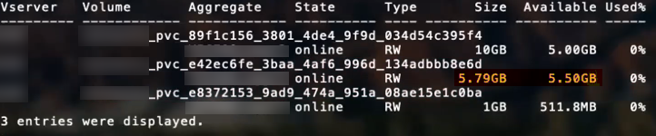

= ONTAP SAN 구성 옵션 및 예
:hardbreaks:
:allow-uri-read: 
:icons: font
:imagesdir: ../media/

[role="lead"]
Astra Trident 설치에서 ONTAP SAN 드라이버를 생성하고 사용하는 방법을 알아보십시오. 이 섹션에서는 백엔드 구성 예제 및 Backend를 StorageClasses에 매핑하는 방법에 대한 세부 정보를 제공합니다.

== 백엔드 구성 옵션

백엔드 구성 옵션은 다음 표를 참조하십시오.

[cols="1,3,2"]
|===
| 매개 변수 | 설명 | 기본값 

| '내전' |  | 항상 1 

| 'torageDriverName'입니다 | 스토리지 드라이버의 이름입니다 | `ontap-nas`, `ontap-nas-economy`, `ontap-nas-flexgroup`, `ontap-san`, `ontap-san-economy` 

| 백엔드이름 | 사용자 지정 이름 또는 스토리지 백엔드 | 드라이버 이름 + "_" + dataLIF 

| 마나멘타LIF | 클러스터 또는 SVM 관리 LIF의 IP 주소입니다.

FQDN(정규화된 도메인 이름)을 지정할 수 있습니다.

IPv6 플래그를 사용하여 Astra Trident를 설치한 경우 IPv6 주소를 사용하도록 설정할 수 있습니다. IPv6 주소는 과 같이 대괄호로 정의해야 합니다 `[28e8:d9fb:a825:b7bf:69a8:d02f:9e7b:3555]`.

원활한 MetroCluster 전환은 를 참조하십시오 <<mcc-best>>. | “10.0.0.1”, “[2001:1234:ABCD::fee]” 

| 다타LIF | 프로토콜 LIF의 IP 주소입니다.

* iSCSI에 대해서는 지정하지 마십시오. * Astra Trident가 사용합니다 link:https://docs.netapp.com/us-en/ontap/san-admin/selective-lun-map-concept.html["ONTAP 선택적 LUN 맵"^] 다중 경로 세션을 설정하는 데 필요한 iSCI LIF를 검색하려면 경고 발생 시 `dataLIF` 명시적으로 정의됩니다.

*MetroCluster의 경우 생략합니다. * 를 참조하십시오 <<mcc-best>>. | SVM에서 파생됩니다 

| 'VM'입니다 | 사용할 스토리지 가상 머신입니다

*MetroCluster의 경우 생략합니다. * 를 참조하십시오 <<mcc-best>>. | SVM 'managementLIF'가 지정된 경우에 파생됩니다 

| 'useCHAP'입니다 | CHAP를 사용하여 ONTAP SAN 드라이버에 대한 iSCSI 인증 [Boolean]. 를 로 설정합니다 `true` Astra Trident에서 백엔드에 제공된 SVM에 대한 기본 인증으로 양방향 CHAP를 구성하고 사용합니다. 을 참조하십시오 link:ontap-san-prep.html["ONTAP SAN 드라이버를 사용하여 백엔드를 구성할 준비를 합니다"] 를 참조하십시오. | 거짓입니다 

| 챕터시크릿 | CHAP 이니시에이터 암호입니다. useCHAP=true인 경우 필수입니다 | "" 

| '라벨' | 볼륨에 적용할 임의의 JSON 형식 레이블 세트입니다 | "" 

| 챕터타겟이니터시크릿 | CHAP 타겟 이니시에이터 암호입니다. useCHAP=true인 경우 필수입니다 | "" 

| 'chapUsername'입니다 | 인바운드 사용자 이름입니다. useCHAP=true인 경우 필수입니다 | "" 

| 'chapTargetUsername'입니다 | 대상 사용자 이름입니다. useCHAP=true인 경우 필수입니다 | "" 

| '고객증명서' | Base64 - 클라이언트 인증서의 인코딩된 값입니다. 인증서 기반 인증에 사용됩니다 | "" 

| 'clientPrivateKey'입니다 | Base64 - 클라이언트 개인 키의 인코딩된 값입니다. 인증서 기반 인증에 사용됩니다 | "" 

| 신탁인증서다 | Base64 - 신뢰할 수 있는 CA 인증서의 인코딩된 값입니다. 선택 사항. 인증서 기반 인증에 사용됩니다. | "" 

| '사용자 이름' | ONTAP 클러스터와 통신하는 데 필요한 사용자 이름입니다. 자격 증명 기반 인증에 사용됩니다. | "" 

| "암호" | ONTAP 클러스터와 통신하는 데 필요한 암호입니다. 자격 증명 기반 인증에 사용됩니다. | "" 

| 'VM'입니다 | 사용할 스토리지 가상 머신입니다 | SVM 'managementLIF'가 지정된 경우에 파생됩니다 

| '토르agePrefix' | SVM에서 새 볼륨을 프로비저닝할 때 사용되는 접두사 나중에 수정할 수 없습니다. 이 매개 변수를 업데이트하려면 새 백엔드를 생성해야 합니다. | `trident` 

| 제한선태사용법 | 사용량이 이 비율을 초과하면 프로비저닝이 실패합니다. NetApp ONTAP 백엔드에 Amazon FSx를 사용하는 경우 를 지정하지 마십시오  `limitAggregateUsage`. 제공 `fsxadmin` 및 `vsadmin` 애그리게이트 사용을 검색하고 Astra Trident를 사용하여 제한하는 데 필요한 권한이 포함되어 있지 않습니다. | ""(기본적으로 적용되지 않음) 

| LimitVolumeSize | 요청된 볼륨 크기가 이 값보다 큰 경우 용량 할당에 실패합니다. 또한 qtree 및 LUN에 대해 관리하는 볼륨의 최대 크기도 제한합니다. | ""(기본적으로 적용되지 않음) 

| '오만유연한' | FlexVol당 최대 LUN 수는 범위[50, 200]에 있어야 합니다. | `100` 

| debugTraceFlags를 선택합니다 | 문제 해결 시 사용할 디버그 플래그입니다. 예: {"api":false, "method":true}

문제 해결 중이지 않고 자세한 로그 덤프가 필요한 경우가 아니면 사용하지 마십시오. | `null` 

| 'useREST' | ONTAP REST API를 사용하는 부울 매개 변수입니다. 
`useREST` 로 설정된 `true`경우 Astra Trident는 ONTAP REST API를 사용하여 백엔드와 통신합니다. 로 설정된 경우 `false`Astra Trident는 ONTAP ZAPI 호출을 사용하여 백엔드와 통신합니다. 이 기능을 사용하려면 ONTAP 9.11.1 이상이 필요합니다. 또한 사용되는 ONTAP 로그인 역할에는 애플리케이션에 대한 액세스 권한이 있어야 `ontap` 합니다. 이는 미리 정의된 역할과 역할에 의해 충족됩니다. `vsadmin` `cluster-admin` Astra Trident 24.06 릴리즈 및 ONTAP 9.15.1 이상부터 는 `userREST` 기본적으로 로 설정되며 `true` , ONTAP ZAPI 호출을 사용하도록 로 변경합니다.
`useREST` `false` 
`useREST` NVMe/TCP에 대해 완전한 자격을 갖추고 있음 | `true` ONTAP 9.15.1 이상, 그렇지 않은 경우 `false`. 

| `sanType` | 를 사용하여 선택합니다 `iscsi` iSCSI 또는 의 경우 `nvme` NVMe/TCP의 경우 | `iscsi` 비어 있는 경우 
|===

== 볼륨 프로비저닝을 위한 백엔드 구성 옵션

에서 이러한 옵션을 사용하여 기본 프로비저닝을 제어할 수 있습니다 `defaults` 섹션을 참조하십시오. 예를 들어, 아래 구성 예제를 참조하십시오.

[cols="1,3,2"]
|===
| 매개 변수 | 설명 | 기본값 

| '팩시배부 | LUN에 대한 공간 할당 | "참" 

| '예비공간' | 공간 예약 모드, "없음"(씬) 또는 "볼륨"(일반) | "없음" 

| 냅샷정책 | 사용할 스냅샷 정책입니다 | "없음" 

| "qosPolicy" | 생성된 볼륨에 할당할 QoS 정책 그룹입니다. 스토리지 풀/백엔드에서 qosPolicy 또는 adapativeQosPolicy 중 하나를 선택합니다. Astra Trident와 함께 QoS 정책 그룹을 사용하려면 ONTAP 9.8 이상이 필요합니다. 비공유 QoS 정책 그룹을 사용하고 정책 그룹이 각 구성요소별로 적용되도록 하는 것이 좋습니다. 공유 QoS 정책 그룹은 모든 워크로드의 총 처리량에 대해 상한을 적용합니다. | "" 

| 적응성 QosPolicy | 생성된 볼륨에 할당할 적응형 QoS 정책 그룹입니다. 스토리지 풀/백엔드에서 qosPolicy 또는 adapativeQosPolicy 중 하나를 선택합니다 | "" 

| 안산예비역 | 스냅숏용으로 예약된 볼륨의 백분율입니다 | "0"인 경우 `snapshotPolicy` "없음"이고, 그렇지 않으면""입니다. 

| 'plitOnClone'을 선택합니다 | 생성 시 상위 클론에서 클론을 분할합니다 | "거짓" 

| 암호화 | 새 볼륨에 NVE(NetApp Volume Encryption)를 사용하도록 설정하고 기본값은 'false'입니다. 이 옵션을 사용하려면 NVE 라이센스가 클러스터에서 활성화되어 있어야 합니다. 백엔드에서 NAE가 활성화된 경우 Astra Trident에 프로비저닝된 모든 볼륨은 NAE가 활성화됩니다. 자세한 내용은 다음을 참조하십시오. link:../trident-reco/security-reco.html["Astra Trident가 NVE 및 NAE와 연동되는 방식"]. | "거짓" 

| `luksEncryption` | LUKS 암호화를 사용합니다. 을 참조하십시오 link:../trident-reco/security-luks.html["LUKS(Linux Unified Key Setup) 사용"].

NVMe/TCP에 대해서는 LUKS 암호화가 지원되지 않습니다. | "" 

| '생태성 스타일'을 참조하십시오 | 새로운 볼륨에 대한 보안 스타일 | `unix` 

| '계층화 정책' | "없음"을 사용하는 계층화 정책 | ONTAP 9.5 SVM-DR 이전 구성의 경우 "스냅샷 전용 

| `nameTemplate` | 사용자 지정 볼륨 이름을 생성하는 템플릿입니다. | "" 
|===

=== 볼륨 프로비저닝의 예

다음은 기본값이 정의된 예입니다.

[listing]
----
---
version: 1
storageDriverName: ontap-san
managementLIF: 10.0.0.1
svm: trident_svm
username: admin
password: <password>
labels:
  k8scluster: dev2
  backend: dev2-sanbackend
storagePrefix: alternate-trident
debugTraceFlags:
  api: false
  method: true
defaults:
  spaceReserve: volume
  qosPolicy: standard
  spaceAllocation: 'false'
  snapshotPolicy: default
  snapshotReserve: '10'

----

NOTE: 'ONTAP-SAN' 드라이버를 사용하여 생성된 모든 볼륨의 경우, Astra Trident가 FlexVol에 10%의 용량을 추가하여 LUN 메타데이터를 수용합니다. LUN은 사용자가 PVC에서 요청하는 정확한 크기로 프로비저닝됩니다. Astra Trident가 FlexVol에 10%를 더합니다(ONTAP에서 사용 가능한 크기로 표시). 이제 사용자가 요청한 가용 용량을 얻을 수 있습니다. 또한 이 변경으로 인해 사용 가능한 공간이 완전히 활용되지 않는 한 LUN이 읽기 전용이 되는 것을 방지할 수 있습니다. ONTAP-SAN-경제에는 적용되지 않습니다.

'스냅샷 보존'을 정의하는 백엔드의 경우 Astra Trident는 다음과 같이 볼륨의 크기를 계산합니다.

[listing]
----
Total volume size = [(PVC requested size) / (1 - (snapshotReserve percentage) / 100)] * 1.1
----
1.1은 LUN 메타데이터를 수용하도록 FlexVol에 추가된 10%의 Astra Trident입니다. 나프산예비공간 = 5%, PVC 요청 = 5GiB의 경우 총 용적 크기는 5.79GiB이고 사용 가능한 크기는 5.5GiB입니다. 'volume show' 명령은 다음 예와 유사한 결과를 표시합니다.

현재 기존 볼륨에 대해 새 계산을 사용하는 유일한 방법은 크기 조정입니다.

== 최소 구성의 예

다음 예에서는 대부분의 매개 변수를 기본값으로 두는 기본 구성을 보여 줍니다. 이는 백엔드를 정의하는 가장 쉬운 방법입니다.

NOTE: NetApp ONTAP에서 Astra Trident와 함께 Amazon FSx를 사용하는 경우 IP 주소 대신 LIF에 대한 DNS 이름을 지정하는 것이 좋습니다.

.ONTAP SAN의 예
[%collapsible]
====
이것은 를 사용하는 기본 구성입니다 `ontap-san` 드라이버.

[listing]
----
---
version: 1
storageDriverName: ontap-san
managementLIF: 10.0.0.1
svm: svm_iscsi
labels:
  k8scluster: test-cluster-1
  backend: testcluster1-sanbackend
username: vsadmin
password: <password>
----
====
.ONTAP SAN 경제 예
[%collapsible]
====
[listing]
----
---
version: 1
storageDriverName: ontap-san-economy
managementLIF: 10.0.0.1
svm: svm_iscsi_eco
username: vsadmin
password: <password>
----
====
[[mcc-best]]
. 예

[]
====
전환 및 전환 중에 백엔드 정의를 수동으로 업데이트할 필요가 없도록 백엔드를 구성할 수 있습니다 link:../trident-reco/backup.html#svm-replication-and-recovery["SVM 복제 및 복구"].

원활한 스위치오버 및 스위치백의 경우 를 사용하여 SVM을 지정합니다 `managementLIF` 를 생략합니다 `dataLIF` 및 `svm` 매개 변수. 예를 들면 다음과 같습니다.

[listing]
----
---
version: 1
storageDriverName: ontap-san
managementLIF: 192.168.1.66
username: vsadmin
password: password
----
====
.인증서 기반 인증의 예
[%collapsible]
====
이 기본 구성 예에서 `clientCertificate`, `clientPrivateKey`, 및 `trustedCACertificate` (신뢰할 수 있는 CA를 사용하는 경우 선택 사항)는 에 채워집니다 `backend.json` 그리고 각각 클라이언트 인증서, 개인 키 및 신뢰할 수 있는 CA 인증서의 base64로 인코딩된 값을 사용합니다.

[listing]
----
---
version: 1
storageDriverName: ontap-san
backendName: DefaultSANBackend
managementLIF: 10.0.0.1
svm: svm_iscsi
useCHAP: true
chapInitiatorSecret: cl9qxIm36DKyawxy
chapTargetInitiatorSecret: rqxigXgkesIpwxyz
chapTargetUsername: iJF4heBRT0TCwxyz
chapUsername: uh2aNCLSd6cNwxyz
clientCertificate: ZXR0ZXJwYXB...ICMgJ3BhcGVyc2
clientPrivateKey: vciwKIyAgZG...0cnksIGRlc2NyaX
trustedCACertificate: zcyBbaG...b3Igb3duIGNsYXNz
----
====
.양방향 CHAP 예
[%collapsible]
====
이 예에서는 를 사용하여 백엔드를 생성합니다 `useCHAP` 를 로 설정합니다 `true`.

.ONTAP SAN CHAP의 예
[listing]
----
---
version: 1
storageDriverName: ontap-san
managementLIF: 10.0.0.1
svm: svm_iscsi
labels:
  k8scluster: test-cluster-1
  backend: testcluster1-sanbackend
useCHAP: true
chapInitiatorSecret: cl9qxIm36DKyawxy
chapTargetInitiatorSecret: rqxigXgkesIpwxyz
chapTargetUsername: iJF4heBRT0TCwxyz
chapUsername: uh2aNCLSd6cNwxyz
username: vsadmin
password: <password>
----
.ONTAP SAN 이코노미 CHAP의 예
[listing]
----
---
version: 1
storageDriverName: ontap-san-economy
managementLIF: 10.0.0.1
svm: svm_iscsi_eco
useCHAP: true
chapInitiatorSecret: cl9qxIm36DKyawxy
chapTargetInitiatorSecret: rqxigXgkesIpwxyz
chapTargetUsername: iJF4heBRT0TCwxyz
chapUsername: uh2aNCLSd6cNwxyz
username: vsadmin
password: <password>
----
====
.NVMe/TCP 예
[%collapsible]
====
ONTAP 백엔드에서 NVMe로 구성된 SVM이 있어야 합니다. NVMe/TCP에 대한 기본 백엔드 구성입니다.

[listing]
----
---
version: 1
backendName: NVMeBackend
storageDriverName: ontap-san
managementLIF: 10.0.0.1
svm: svm_nvme
username: vsadmin
password: password
sanType: nvme
useREST: true
----
====
.nameTemplate이 포함된 백엔드 구성 예
[%collapsible]
====
[listing]
----
---
version: 1
storageDriverName: ontap-san
backendName: ontap-san-backend
managementLIF: <ip address>
svm: svm0
username: <admin>
password: <password>
defaults: {
    "nameTemplate": "{{.volume.Name}}_{{.labels.cluster}}_{{.volume.Namespace}}_{{.volume.RequestName}}"
},
"labels": {"cluster": "ClusterA", "PVC": "{{.volume.Namespace}}_{{.volume.RequestName}}"}
----
====

== 가상 풀의 백엔드 예

이러한 백엔드 정의 파일 샘플에서는 와 같은 모든 스토리지 풀에 대해 특정 기본값이 설정됩니다 `spaceReserve` 없음, `spaceAllocation` 거짓일 경우, 및 `encryption` 거짓일 때. 가상 풀은 스토리지 섹션에 정의됩니다.

Astra Trident가 "Comments" 필드에 프로비저닝 레이블을 설정합니다. FlexVol에 주석이 설정됩니다. Astra Trident는 프로비저닝할 때 가상 풀에 있는 모든 레이블을 스토리지 볼륨에 복사합니다. 편의를 위해 스토리지 관리자는 가상 풀 및 그룹 볼륨별로 레이블을 레이블별로 정의할 수 있습니다.

이 예에서는 일부 스토리지 풀이 자체적으로 설정됩니다 `spaceReserve`, `spaceAllocation`, 및 `encryption` 일부 풀은 기본값을 재정의합니다.

.ONTAP SAN의 예
[%collapsible]
====
[listing]
----
---
version: 1
storageDriverName: ontap-san
managementLIF: 10.0.0.1
svm: svm_iscsi
useCHAP: true
chapInitiatorSecret: cl9qxIm36DKyawxy
chapTargetInitiatorSecret: rqxigXgkesIpwxyz
chapTargetUsername: iJF4heBRT0TCwxyz
chapUsername: uh2aNCLSd6cNwxyz
username: vsadmin
password: <password>
defaults:
  spaceAllocation: 'false'
  encryption: 'false'
  qosPolicy: standard
labels:
  store: san_store
  kubernetes-cluster: prod-cluster-1
region: us_east_1
storage:
- labels:
    protection: gold
    creditpoints: '40000'
  zone: us_east_1a
  defaults:
    spaceAllocation: 'true'
    encryption: 'true'
    adaptiveQosPolicy: adaptive-extreme
- labels:
    protection: silver
    creditpoints: '20000'
  zone: us_east_1b
  defaults:
    spaceAllocation: 'false'
    encryption: 'true'
    qosPolicy: premium
- labels:
    protection: bronze
    creditpoints: '5000'
  zone: us_east_1c
  defaults:
    spaceAllocation: 'true'
    encryption: 'false'
----
====
.ONTAP SAN 경제 예
[%collapsible]
====
[listing]
----
---
version: 1
storageDriverName: ontap-san-economy
managementLIF: 10.0.0.1
svm: svm_iscsi_eco
useCHAP: true
chapInitiatorSecret: cl9qxIm36DKyawxy
chapTargetInitiatorSecret: rqxigXgkesIpwxyz
chapTargetUsername: iJF4heBRT0TCwxyz
chapUsername: uh2aNCLSd6cNwxyz
username: vsadmin
password: <password>
defaults:
  spaceAllocation: 'false'
  encryption: 'false'
labels:
  store: san_economy_store
region: us_east_1
storage:
- labels:
    app: oracledb
    cost: '30'
  zone: us_east_1a
  defaults:
    spaceAllocation: 'true'
    encryption: 'true'
- labels:
    app: postgresdb
    cost: '20'
  zone: us_east_1b
  defaults:
    spaceAllocation: 'false'
    encryption: 'true'
- labels:
    app: mysqldb
    cost: '10'
  zone: us_east_1c
  defaults:
    spaceAllocation: 'true'
    encryption: 'false'
- labels:
    department: legal
    creditpoints: '5000'
  zone: us_east_1c
  defaults:
    spaceAllocation: 'true'
    encryption: 'false'
----
====
.NVMe/TCP 예
[%collapsible]
====
[listing]
----
---
version: 1
storageDriverName: ontap-san
sanType: nvme
managementLIF: 10.0.0.1
svm: nvme_svm
username: vsadmin
password: <password>
useREST: true
defaults:
  spaceAllocation: 'false'
  encryption: 'true'
storage:
- labels:
    app: testApp
    cost: '20'
  defaults:
    spaceAllocation: 'false'
    encryption: 'false'
----
====

== 백엔드를 StorageClasses에 매핑합니다

다음 StorageClass 정의는 을 참조하십시오 <<가상 풀의 백엔드 예>>. 를 사용합니다 `parameters.selector` 필드에서 각 StorageClass는 볼륨을 호스팅하는 데 사용할 수 있는 가상 풀을 호출합니다. 선택한 가상 풀에 볼륨이 정의되어 있습니다.

* 를 클릭합니다 `protection-gold` StorageClass는 의 첫 번째 가상 풀에 매핑됩니다 `ontap-san` 백엔드. 골드 레벨 보호 기능을 제공하는 유일한 풀입니다.
+
[listing]
----
apiVersion: storage.k8s.io/v1
kind: StorageClass
metadata:
  name: protection-gold
provisioner: csi.trident.netapp.io
parameters:
  selector: "protection=gold"
  fsType: "ext4"
----
* 를 클릭합니다 `protection-not-gold` StorageClass는 의 두 번째 및 세 번째 가상 풀에 매핑됩니다 `ontap-san` 백엔드. 금 이외의 보호 수준을 제공하는 유일한 풀입니다.
+
[listing]
----
apiVersion: storage.k8s.io/v1
kind: StorageClass
metadata:
  name: protection-not-gold
provisioner: csi.trident.netapp.io
parameters:
  selector: "protection!=gold"
  fsType: "ext4"
----
* 를 클릭합니다 `app-mysqldb` StorageClass는 의 세 번째 가상 풀에 매핑됩니다 `ontap-san-economy` 백엔드. mysqldb 유형 앱에 대한 스토리지 풀 구성을 제공하는 유일한 풀입니다.
+
[listing]
----
apiVersion: storage.k8s.io/v1
kind: StorageClass
metadata:
  name: app-mysqldb
provisioner: csi.trident.netapp.io
parameters:
  selector: "app=mysqldb"
  fsType: "ext4"
----
* 를 클릭합니다 `protection-silver-creditpoints-20k` StorageClass는 의 두 번째 가상 풀에 매핑됩니다 `ontap-san` 백엔드. 실버 레벨 보호 및 20,000포인트 적립을 제공하는 유일한 풀입니다.
+
[listing]
----
apiVersion: storage.k8s.io/v1
kind: StorageClass
metadata:
  name: protection-silver-creditpoints-20k
provisioner: csi.trident.netapp.io
parameters:
  selector: "protection=silver; creditpoints=20000"
  fsType: "ext4"
----
* 를 클릭합니다 `creditpoints-5k` StorageClass는 의 세 번째 가상 풀에 매핑됩니다 `ontap-san` 에 있는 백엔드 및 네 번째 가상 풀입니다 `ontap-san-economy` 백엔드. 5000 크레딧 포인트를 보유한 유일한 풀 서비스입니다.
+
[listing]
----
apiVersion: storage.k8s.io/v1
kind: StorageClass
metadata:
  name: creditpoints-5k
provisioner: csi.trident.netapp.io
parameters:
  selector: "creditpoints=5000"
  fsType: "ext4"
----
* 를 클릭합니다 `my-test-app-sc` StorageClass 가 에 매핑됩니다 `testAPP` 의 가상 풀입니다 `ontap-san` 를 사용하여 운전합니다 `sanType: nvme`. 이것은 유일한 풀 제안입니다 `testApp`.
+
[listing]
----
---
apiVersion: storage.k8s.io/v1
kind: StorageClass
metadata:
  name: my-test-app-sc
provisioner: csi.trident.netapp.io
parameters:
  selector: "app=testApp"
  fsType: "ext4"
----

Astra Trident가 선택한 가상 풀을 결정하고 스토리지 요구 사항을 충족시킵니다.
