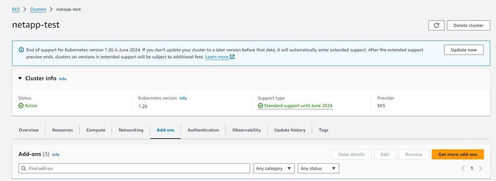
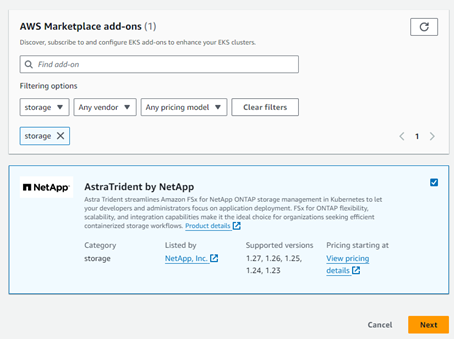
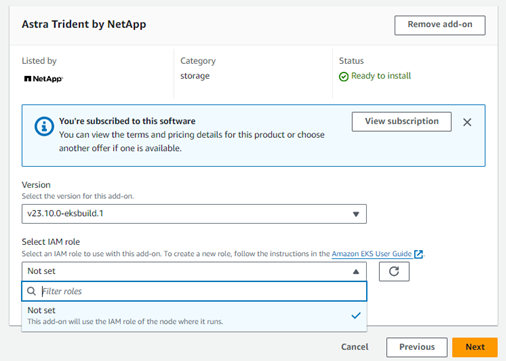
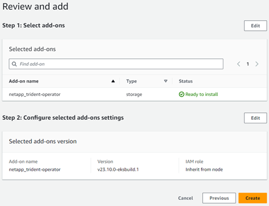
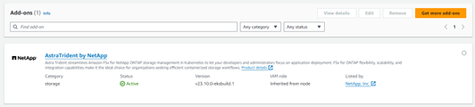

= EKS cluser에서 Astra Trident EKS 애드온 버전 23.10을 구성합니다
:hardbreaks:
:allow-uri-read: 
:icons: font
:imagesdir: ../media/

[role="lead"]
Astra Trident는 Kubernetes에서 Amazon FSx for NetApp ONTAP 스토리지 관리를 간소화하여 개발자와 관리자가 애플리케이션 구축에 집중할 수 있도록 지원합니다. Astra Trident EKS 애드온에는 최신 보안 패치 및 버그 수정이 포함되어 있으며 AWS에서 Amazon EKS와 함께 사용할 수 있다는 것을 검증했습니다. EKS 애드온을 사용하면 Amazon EKS 클러스터의 보안과 안정성을 지속적으로 보장하고 애드온을 설치, 구성 및 업데이트하는 데 필요한 작업량을 줄일 수 있습니다.

== 필수 구성 요소

AWS EKS용 Astra Trident 애드온을 구성하기 전에 다음 사항을 확인하십시오.

* 애드온 가입이 있는 Amazon EKS 클러스터 계정입니다
* AWS 마켓플레이스에 대한 AWS 권한:
`"aws-marketplace:ViewSubscriptions",
"aws-marketplace:Subscribe",
"aws-marketplace:Unsubscribe`
* AMI 유형: Amazon Linux 2 (AL2_x86_64) 또는 Amazon Linux 2 Arm (AL2_ARM_64)
* 노드 유형: AMD 또는 ARM
* 기존 Amazon FSx for NetApp ONTAP 파일 시스템

== 단계

. EKS Kubernetes 클러스터에서 * Add-ons * 탭으로 이동합니다.
+

. AWS Marketplace 애드온 * 으로 이동하여 _STORAGE_CATEGORY를 선택합니다.
+

. AstraTrident by NetApp * 를 찾고 Astra Trident 애드온 확인란을 선택합니다.
. 원하는 추가 기능 버전을 선택합니다.
+

. 노드에서 상속할 IAM 역할 옵션을 선택합니다.
. 필요에 따라 옵션 설정을 구성하고 * 다음 * 을 선택합니다.
+

. Create * 를 선택합니다.
. 애드온의 상태가 _Active_인지 확인합니다.
+

== CLI를 사용하여 Astra Trident EKS 애드온을 설치/제거합니다

.CLI를 사용하여 Astra Trident EKS 애드온을 설치합니다.
다음 명령 예에서는 Astra Trident EKS 애드온을 설치합니다.
`eksctl create addon --cluster K8s-arm --name netapp_trident-operator --version v23.10.0-eksbuild.`
`eksctl create addon --cluster K8s-arm --name netapp_trident-operator --version v23.10.0-eksbuild.1` (전용 버전 포함)

.CLI를 사용하여 Astra Trident EKS 애드온을 제거합니다.
다음 명령을 실행하면 Astra Trident EKS 애드온이 제거됩니다.
`eksctl delete addon --cluster K8s-arm --name netapp_trident-operator`
